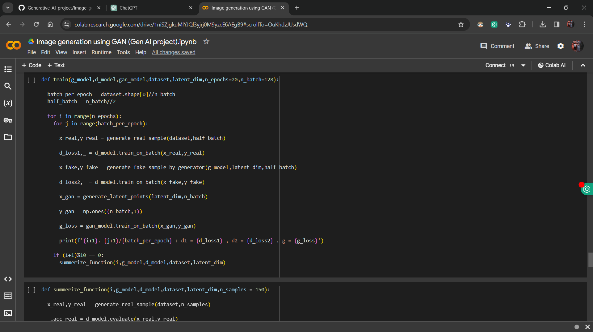
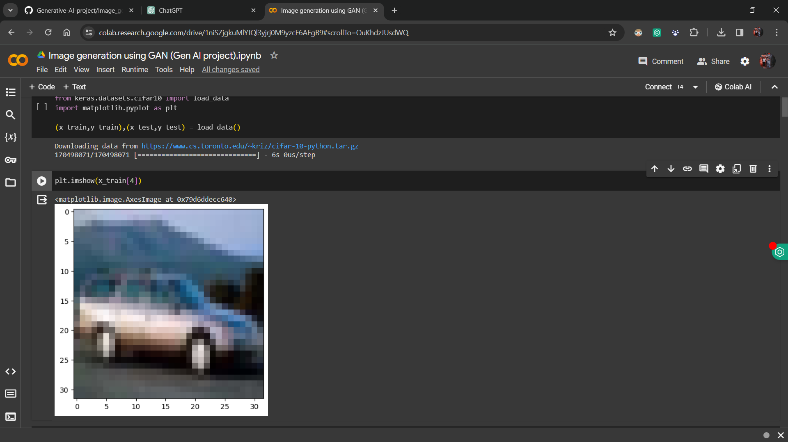
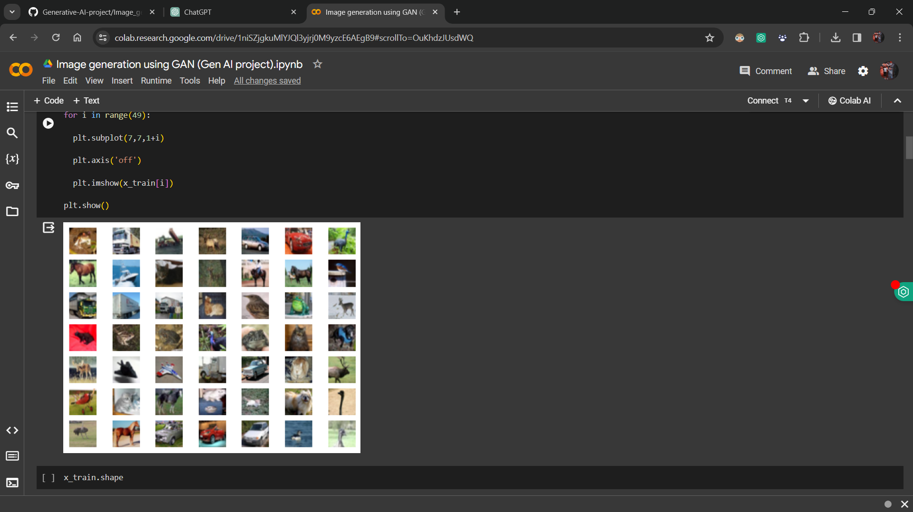

# Gen AI - Image Generation using GAN

Gen AI is a project focused on generating CIFAR-10-like images using Generative Adversarial Networks (GANs). The custom GAN model consists of a Generator and a Discriminator, trained to produce realistic images and differentiate between real and generated ones.

## Table of Contents
- [Key Features](#key-features)
- [Use Case](#use-case)
- [Usage](#usage)
  - [Setup](#setup)
  - [Training](#training)
  - [Generation](#generation)
- [Note](#note)
- [Screenshots](#screenshots)
- [License](#license)

## Key Features
- Trains a custom GAN model on the CIFAR-10 dataset.
- Generates images resembling CIFAR-10 images with unique variations.
- Supports training and image generation via Jupyter Notebooks or Google Colab.

## Use Case
- Data Augmentation: Augment existing datasets with synthetic images.
- Concept Exploration: Explore novel concepts and artistic expressions.
- Prototyping: Create mock-ups and test interfaces with generated images.

## Usage
### Setup
1. Clone the repository to your local machine.
2. Ensure dependencies are installed, including Python, TensorFlow, and Keras.

### Training
1. Open the provided Jupyter Notebook or upload it to Google Colab.
2. Run the notebook to train the GAN model.
3. Utilize GPU acceleration for faster training, especially on Google Colab.

### Generation
- After training, use the trained model to generate new images.
- Experiment with different latent space values to explore image variations.

## Note
- No graphical user interface (UI) is provided. Interact with the project through Jupyter Notebooks or Google Colab.
- GPU acceleration is recommended for efficient training.
- Contributions are welcome! Fork the repository, make improvements, and submit pull requests.

## Screenshots

## License
This project is licensed under the MIT License. See the [LICENSE](LICENSE) file for details.

For any inquiries or support, please contact [abhijeetmaharana77@.com](mailto:abhijeetmaharana77@gmail.com).
